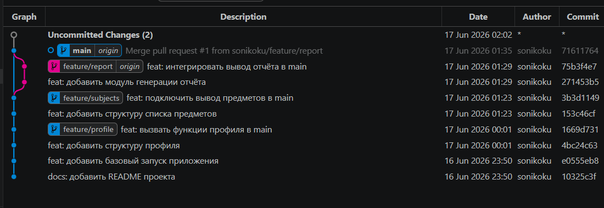
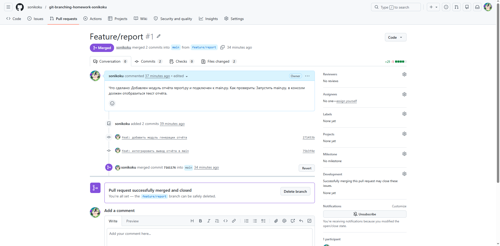
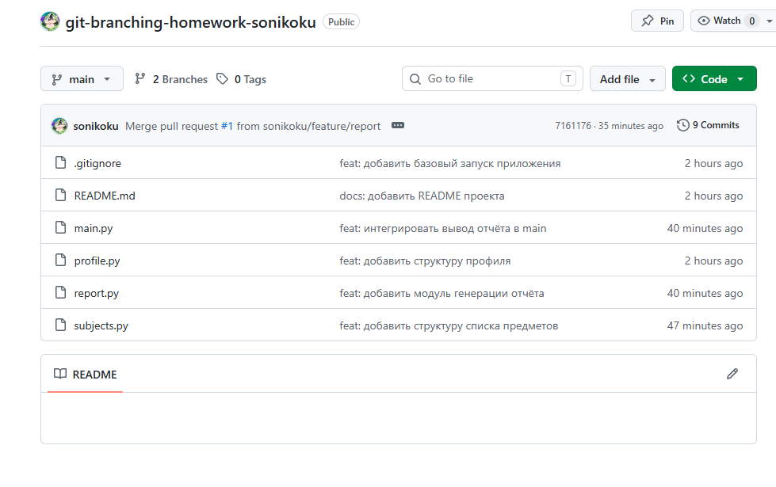

# Git Branching Homework

## Описание проекта
Проект представляет собой консольное учебное приложение **Student Branching App**, созданное для изучения веток, процессов слияния (merge) и работы с Pull Request в системе контроля версий Git.

## Использованные ветки

| Ветка | Что делал | Как попала в main |
|---|---|---|
| feature/profile | Создал профиль студента (файл `profile.py`) и подключил его к главной программе. | merge локально |
| feature/subjects | Добавил список учебных предметов (файл `subjects.py`) и настроил их вывод. | merge локально |
| feature/report | Сделал модуль генерации итогового отчета (файл `report.py`). | Pull Request |
| experiment/broken-idea | Создал тестовый файл `broken.py` для проверки. | удалена без merge |

## Pull Request
Ссылка на PR: https://github.com/sonikoku/git-branching-homework-sonikoku/pull/1

## Коммиты
1. `Merge pull request #1 from sonikoku/feature/report`
2. `feat: интегрировать вывод отчёта в main`
3. `feat: добавить модуль генерации отчёта`
4. `feat: подключить вывод предметов в main`
5. `feat: добавить структуру списка предметов`
6. `feat: вызвать функции профиля в main`
7. `feat: добавить структуру профиля`
8. `feat: добавить базовый запуск приложения`
9. `docs: добавить README проекта`

## Скриншоты

- три пункта с конца - до merge
- 4 пункт с конца - первый merge (локально)
- 6 пункт с конца - второй merge (локально)
- 1 пункт с начала - третий merge (GitHub)

- созданный и закрытый Pull Request;

- финальная ветка main на GitHub.

## Вывод
В ходе лабораторной работы я научилась работать с ветками в Git и понял, как делать разные части программы отдельно друг от друга, чтобы код не перемешивался. Я освоила слияние веток на компьютере через команду `merge` и создание Pull Request на сайте GitHub. Также я убедилась, что ненужные ветки-эксперименты можно удалять без слияния, сохраняя основную историю проекта абсолютно чистой.